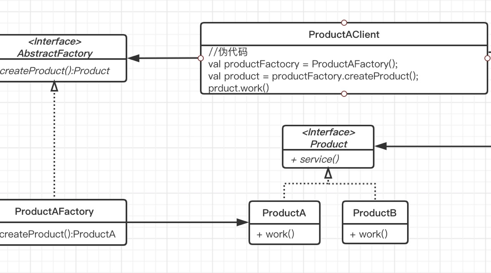

### Abstract Factory
---
#### 什么是抽象工程模式
提供一个接口可以创建各种对象，调用方不需要知道具体的对象

#### 解决什么样的问题
首先想一想，如果不使用工程模式，调用方需要那个对象，自己就创建自己需要的对象。
这样有很大的问题，调用方知道的太多了，他知道自己用的是那个类。
这个每个调用方都得知道我要用哪个类，我应该使用new哪个类，严重违反类**依赖倒置原则（DIP）**。
举个例子：如果我们有一天不实用其中的几个类了，或者升级使用其他的类。
这个时候麻烦的事情就来了，我们得让所有的调用方去修改。是不是和调用方耦合的紧紧的。
所以我们需要创建多个不同的或者不稳定的对象时，可以选择**工厂方法模式**，
这样调用方只依赖接口或者抽象类，不用知道我们有多少个具体类。
#### 现学现用

#### 最佳实践