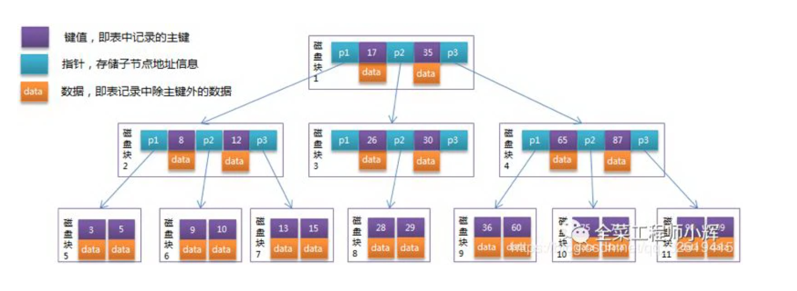
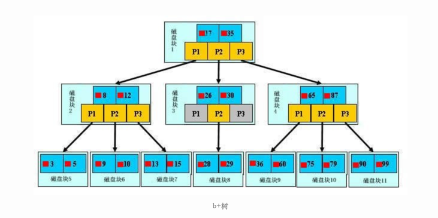

索引
---

# 索引的作用

现在使用Mysql公司越来越多，那对于SQL来说，性能的问题一般不在insert和update中，而是在复杂的查询会有性能瓶颈。比如对于用户的展示肯定要更快更好。

那么索引就是为了提升查询性能的，就如字典查词一样，我们会按拼音或者偏旁先查询，再去找到词真正的位置。

# 有哪些索引

## 使用索引的背景(磁盘IO和预读)

对于系统有分内存和磁盘，磁盘和内存直接的读取性能差别百倍以上。
磁盘读写是机械操作，一次IO的时间差不多几毫秒，相比是很慢的，一次IO读取会把相邻的数据也读取到缓存内存中，读取的数据我们称之为一页，一页一般有多少数据跟操作系统有关，一般4k或者8k。

这里如果不使用索引去读取数据，假如从1万条数据中查询一条数据，将需要1万次IO，太可怕了。

## Hash索引

Memory引擎使用Hash索引，了解下就行。 跟HashMap的`get(key)`原理一样，根据hashCode可以找到对于的数据信息，在Mysql中， hash索引中存的是数据的地址，通过key的hash值找到对于的数据地址(指针)
，通过地址就能找到数据。 这里会有几个问题， 一，哈希碰撞，查询效率就不会是O(1)，随着数据量的增加效率越低，数据越多越容易碰撞。 二，不能利用索引排序查询 三，不能多字段联合查询 四，不支持返回查询

## B-树到B+树

InnoDb和MyISAM引擎使用

### 什么是B-树

- 数据分布在每个节点中
- 性能类型二分查找

### 什么是B+树

- 数据分布在每个叶子节点中
- 非叶子节点盘存放指针
- 每个叶子节点中的数据是有序的

### 为什么Mysql使用B+树

- 提过查询性能，因为数据都在叶子节点，所以一次IO的读取的数据就多了，所以IO就减少了。
- 查询稳定，因为数据都在叶子节点上，每次的IO次数是一样的，所以查询时间也是相差不多的。

## InnoDB与MyISAM的索引区别

### MyISAM
非聚集索引
索引数据和表数据的分布存放的，叶子节点记录的是数据的指针地址

主键索引需要唯一 辅助索引可以重复

### InnoDB
聚集索引
主键索引叶子节点存放的数据， 对于辅助索引叶子节点存放的是主键的值，需要在通过主键去查找，这样性能相比主键会低。

## 几种索引的概念

- 普通索引：就是任选依赖作为索引
- 唯一索引：指定不会重复的列为索引，可以为null
- 联合索引：指定多列为一个索引
- 主键索引：一个表只能有一个主键索引，主键索引不能为空
- 聚集索引：通过查找到的叶子节点是可以直接从中找到数据的
- 非聚集索引：叶子节点记录的数据id，通过id需要再去表中查询真正的数据，*回表*

# 索引的使用

## 索引原则

- 最左前缀匹配查询原则，查询是通过where后面右查询，直到遇到范围查询(>,<,between,like)就会停下来
- 索引顺序和排序顺序一致
- 做好是联合索引，不要统一字段建立多个索引
- 选择区分度较高的列，id的区分度是1%
- 索引列尽量不要参与计算

## sql 优化

查询sql本身的查询逻辑是否ok 看where条件后的查询区分度是按多到少的吗 使用explain 分析 调整sql，遵循索引原则 纯sql优化没有效果，sql太复杂，说明系统设计不合理，不要单纯想通过sql去优化所有的查询性能