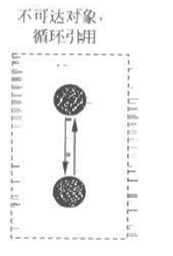
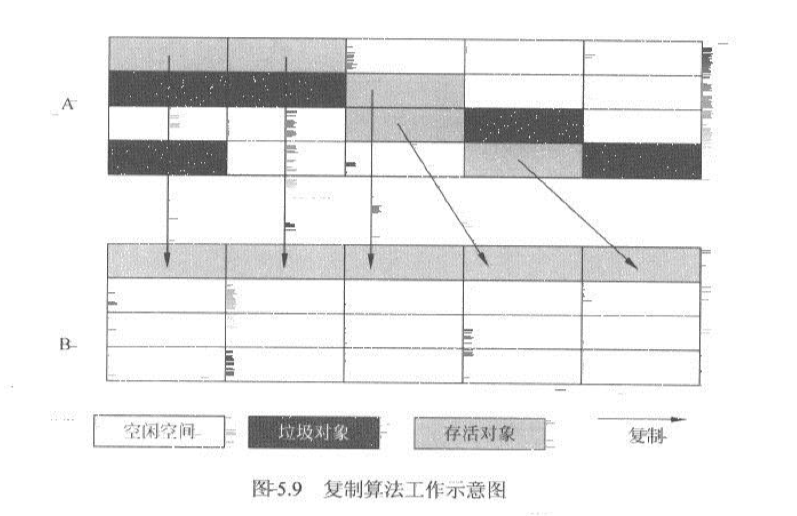
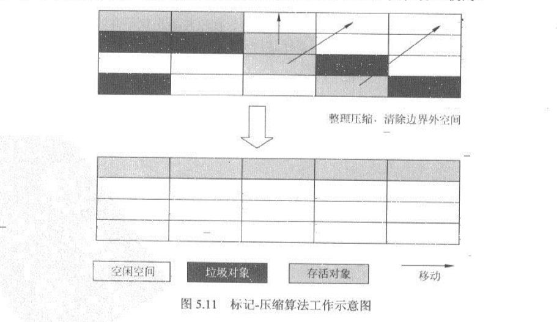
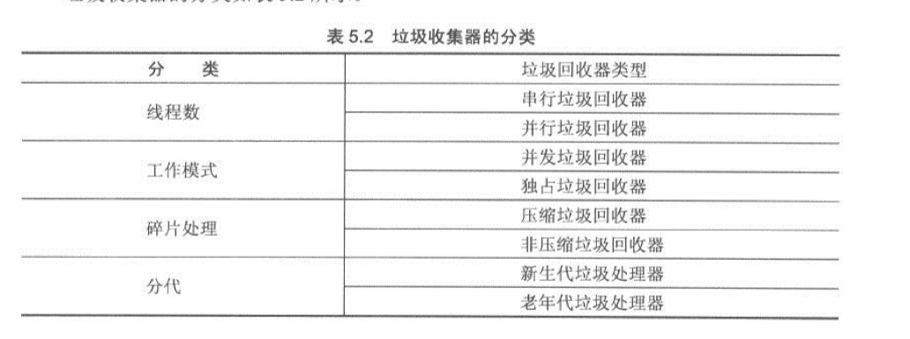

性能调优
---
性能调优必须要有明确的目标，不要为了调优而调优，如果当前程序没有明显的性能问题，盲目的主观性的去调整，往往会带来更大的风险。

# 木桶原理

性能的瓶颈往往是由性能最差的组件导致的

# Amdahl 定律

即阿姆达尔定律,见[维基百科](https://zh.wikipedia.org/wiki/%E9%98%BF%E5%A7%86%E8%BE%BE%E5%B0%94%E5%AE%9A%E5%BE%8B)
性能不止是提供处理器数量，也要考虑代码的并行化，这样才能更合理的利用资源

# 需要考虑的调优

- 设计调优 使用合适的设计，避免资源浪费
- 代码调优 使用正确的api,使用合适的算法和数据结构
- JVM调优 堆内存，垃圾回收器，JVM参数
- 数据库调优
    - 应用层调优，使用合理的连接机制
    - 对数据库调优，连表查询可以使用冗余字段；大表可以分表，分库；增加合适有效的索引
    - 数据库本身的调优，不同数据库有不同调整策略
- 应用部署的环境调优 服务器cpu，内存，磁盘等等

# 设计调优

## 设计模式

### 单例模式

### 代理模式

Hibernate框架对实体类的动态代理用于延迟加载的经典实现，可以深入了解下Hibernate的内部实现。

### 享元模式

如果每次创建的对象都是相同的（使用方没什么区别），就不需要每次都去创建对象，返回已经创建好的对象。

比如想国家地区等不经常变的对象都可以使用缓存来返回已经创建好的对象，不用每次返回新的对象。 jdk的包装类型

```java
class Demo {
    public valueOf(int i) {
        //当在-128~127直接都是从缓存获取的
        Integer.valueOf(i);
    }
}
```

Guava的Cache

### 装饰者模式

### 观察者模式

事件监听，发布通知，尽量不用使用轮训

### Value Object模式

```java
class OrderAggregate {
    private Client client;
    private Product product;
    private Order order;
}
```

也算是聚合，聚合的多个对象集，减少多次网络IO

### 业务代理模式

也就是使用聚合服务，减少客户端与服务端多次网络IO

## 常用优化组件和方式

### 缓冲(Buffer)

IO 操作很容易造成性能瓶颈，尽可能在IO操作中增加缓冲

例如NIO缓冲、`BufferedWriter`和`BufferedOutputStream`

### 缓存(Cache)

对于频繁获取的数据，修改不怎么频繁的数据可以使用缓存

常见的： EHCache，GoogleCache

### 对象复用"池"

如果资源/对象被频繁的使用，我们不需要每次都新建，而是将将实例保存到池里，使用的时候取出来。池可以是数组，链表或者任何集合

常见的池化技术：线程池，连接池 在程序中使用数据库连接池和线程池，可以有效地改善系统在高并发下的性能。

### 使用并行

### 负载均衡

tomcat nginx

### 时间换空间

```
a=a+b
b=a-b
a=a-b
```

### 空间换时间

## Java程序性能调优

### 字符串

有个有意思的问题：subString()
在jdk 1.6会出现内存泄漏导致的内存溢出 在jdk 1.8就不会了

### 引用

强引用、软引用、弱引用和虚引用

软引用和弱引用适合用于做可有可无的数据缓存，资源不紧张时存在，紧张时回收

### 使用native方法

```
arraycopy()
```

### 使用buffer进行IO操作

文件读写使用BufferedOutputStream、BufferedInputStream或者BufferedWriter、BufferedReader

## 并行程序开发设计

### 使用Future思想

去除主线程的等待时间，在这部分时间去处理其他任务

### Master-Work

将串行任务并行化，分解任务并行处理

### Guarded Suspension

保护暂停，用于有很多任务，但是处理不过来，任务也不能丢弃，需要把等待的任务缓存下来。比如游戏登录排队。

用来解决瞬时压力问题

### 定义不变对象或者变量

对象无状态，变量不可修改

可以解决多个线程数据同步的问题

### 生产者和消费者

### 不用无限制的创建线程

对线程的数量最好做的控制，不要大量地不限制地创建线程

使用线程池

### 线程池

Executor: ExecutorService有几种创建线程池的工程方法，小量可以使用。

ThreadPoolExecutor:
需要注意，指定线程数量，队列数量，拒绝策略

corePoolSize:指定的线程数量

maximumPoolSize:能创建的最大线程

keepAliveTime:多余线程的存活时间

unit:存活单位

workQueue:线程处理不过来是任务存放的队列。

```
直接提交队列:SynchronousQueue,任务不会缓存,来了就新增线程,大于maximumPoolSize会执行拒绝策略
有界队列:ArrayBlockingQueue,超过指定数量则创建新线程,大于maximumPoolSize会将任务缓存在队列中，队列满了就执行拒绝策略
无界队列:LinkedBlockinigQueue,超过指定数量，就会缓存到队列中，不会触发max,也不会触发拒绝策略，知道没资源了
优先队列:PriorityBlockingQueue，是一个特殊的无界队列，只不过是可以指定顺序
```

threadFactory:线程工厂，用于创建线程，一般默认就行

handler: 拒绝策略

```
AbortPolicy:直接抛异常，
CallerRunsPolicy:队列满了，当前任务同步执行
DiscardOldedestPolicy:丢弃队列中最老的任务，就是最新进入队列的任务，丢弃掉后尝试提交到队列
DiscardPolicy:丢弃当前任务
```

### 锁性能优化

- 避免很多线程直接的切换，线程的创建、销毁和切换都需要资源
- 避免死锁
- 减少锁持有时间
- 减少锁的粒度，也就是锁的代码范围
- 使用读写分离锁
- 锁分离
- 优先使用内部锁(synchronized)而不是重入锁(ReentrantLock)
- 锁合并，同一个锁尽量合并，开锁和释放都很耗时间
- 自旋锁，对于切换比较耗资源的可以使用，尤其是竞争不激烈的场景，-XX:+UseSpinning开启自旋，-XX:PreBlockSpin自旋次数
- 锁消除，清除无意义请求锁时间，`逃逸分析-XX:+DoEscapeAnalysis`
- 偏向锁，此锁再次请求不会做同步相关操作，`-XX:+UseBiasedLocking`,锁竞争激烈情况下性能反而下降

#### synchronized

- 不会死锁
- 使用简单
- jdk 1.6有很大的优化，使用偏向锁

### 无锁的并行

在高并发情况下，锁竞争激烈反而会影响系统性能，可以使用非阻塞编程

#### CAS

CAS(V,E,N),V(value)表示需要更新的变量，E(expect)表示预期值，N(new)表示新值, 只有当E==V时，才会V=N。CAS是乐观锁，并发时只有一个可以操作失败，其他都会失败。
对于数据量不是特别大的业务可以使用乐观锁保证数据一致性。

#### 原子操作

JDK的`java.util.concurrent.atomic`是无锁操作，也是基于CAS算法思想做循环尝试执行。 atomic包下的更新操作要比加锁的算法性能高很多，一般建议优先使用。

#### Amino框架

Apache下项目

- 不会死锁，为什么？
- 确保系统整体进度？
- 高并发下不会出现锁竞争，使用无锁
- 有成熟的无锁结构，不需要很重的开发

##### 无锁类

- LockFreeList和LockFreeVector
- LockFreeSet
- LockFreeBSTree和Graph
- MasterWork

#### 协程

JAVA本身没有直接操作线程的语法，可以使用[kilim](https://github.com/kilim/kilimKilim)

## 垃圾回收

垃圾回收时会暂停应用线程

### 垃圾回收算法和思想

#### 引用计数法

比较经典也比较老的算法，当对象被引用就计数加1，引用失效就减1，当没有引用就是0。 此算法有个问题就是无法处理循环引用，所以Java垃圾回收器没有使用此算法


#### 标记-清除算法

通过根节点标记所有可达的对象，有就标记对象，之后做清除操作，对没有标记的做清除， 这里有个问题就是清除完空间是碎片的，在分配对象是效率比较低。

#### 复制算法

将对象的空间分配为两份，一份是当前对象的存放空间A，另一个是空的空间B用来copy另一个对象中的存活的对象，之后会清理掉A空间，并且将B更新为当前使用的空间。 这样可以清理空间也保证空间的连续性。
复制算法使用于新生代，因为在新生代垃圾对象多余存活对象。 不好处是需要两份空间。


#### 标记-压缩算法

在老年代大部分是存活对象，使用复制算法成本会很高，所以使用标记压缩算法。 此算法实在标记-清除上改进的，在标记后将存活对象移动到一边，之后清理垃圾对象，这样既可以保证空间的连续性，又不需要两块空间。


#### 增量算法

垃圾收集线程和应用线程交替执行，这样可以保证垃圾清理过程中可以间歇性的执行应用程序，但是频繁的切换线程和上下文转化会造成系统吞吐量下降。

#### 分代思想

根据不同对象回收情况使用不同的垃圾回收算法，区分新生代和老年代。 大部分垃圾回收器都区分了新生代和老年代。


### 垃圾收集器

#### 垃圾收集器分类



#### GC策略指标

- 吞吐量：应用程序执行时间/(应用程序执行时间+GC处理时间)
- 垃圾回收器负载:GC处理时间/(应用程序执行时间+GC处理时间)
- 停顿时间:GC执行时，应用程序停止时间
- 垃圾回收频率：GC多久执行一次的时间
- 反应时间：对象被清理完并释放空间的时间
- 堆分配：堆内存区间划分 不可能将所以指标都调整到最优，根据系统情况调整。

### JVM 调优

#### 调优参数

https://docs.oracle.com/javase/8/docs/technotes/tools/unix/java.html
https://www.oracle.com/java/technologies/javase/vmoptions-jsp.html
https://help.aliyun.com/document_detail/148851.html
http://www.kailing.pub/article/index/arcid/210.html

# 性能调优工具

## Linux 命令

[命令大全](https://www.linuxcool.com/)
